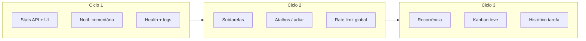

# Roadmap de produto e melhorias — Todo App

Documento de referência para planejamento de funcionalidades e melhorias técnicas. Complementa o [ROADMAP.md](../ROADMAP.md) (foco em implementação técnica do backend).

**Última atualização:** 2026-05-27

---

## O que já está forte

O projeto já cobre o núcleo de um app de tarefas colaborativo:

- CRUD de tarefas com filtros, busca, paginação, prioridades e tags
- Comentários e compartilhamento de tarefas
- Grupos com convites e colaboração restrita
- Notificações: e-mail, Telegram, Web Push (PWA) e in-app
- Lembretes com horário (`task_reminder`, offset configurável)
- Base de conformidade LGPD (exportação, exclusão, políticas)

O próximo passo natural é **fechar lacunas de produto** e **endurecer operação** antes de features muito grandes.

---

## Prioridade alta — produto

### 1. Dashboard / estatísticas (`GET /stats`) ✅

Implementado: `GET /api/v1/stats` com resumo, hoje, `by_type`, `by_priority` e `in_progress`. Frontend usa `useTaskStats` na home.

| Esforço | Impacto |
|---------|---------|
| ✅ Feito | Alto |

### 2. Notificação quando alguém comenta ✅

Implementado: in-app `task_comment` para dono, quem delegou e compartilhados (exceto o autor). Também `task_completed` para quem criou/delegou a tarefa quando o responsável marca como concluída.

| Esforço | Impacto |
|---------|---------|
| ✅ Feito | Alto (família/equipe) |

### 3. Subtarefas (`parent_task_id`)

Checklist dentro da tarefa — ideal para compras, reforma, viagem. Encaixa bem com grupos.

| Esforço | Impacto |
|---------|---------|
| Médio | Alto |

### 4. Recorrência de tarefas

Tarefas que se repetem (diária, semanal, mensal). Muito pedido em apps domésticos. Começar simples: regra + próxima ocorrência.

| Esforço | Impacto |
|---------|---------|
| Médio–alto | Muito alto no uso diário |

### 5. Templates de tarefas

Reutilizar título, tags, prioridade e lembrete (“Rotina manhã”, “Lista mercado”). Combinável com recorrência.

| Esforço | Impacto |
|---------|---------|
| Baixo–médio | Médio–alto |

---

## Prioridade alta — experiência (frontend / PWA)

### 6. Vista Kanban ou por colunas

Colunas: A fazer | Em progresso | Concluído (ou por prioridade). Formalizar estados já parcialmente presentes na UI.

| Esforço | Impacto |
|---------|---------|
| Médio | Alto |

### 7. Atalhos e ações rápidas

- Concluir tarefa com um toque (ex.: swipe no mobile)
- “Adiar 1 dia / 1 hora” sem abrir o formulário completo
- Duplicar tarefa

| Esforço | Impacto |
|---------|---------|
| Baixo–médio | Alto no mobile/PWA |

### 8. Modo offline básico (PWA)

Fila local de criação/edição/conclusão e sincronização ao voltar online. Diferencial com Wi‑Fi instável.

| Esforço | Impacto |
|---------|---------|
| Alto | Alto (se uso intenso no celular) |

### 9. Preferências por canal de lembrete

Evoluir de opt-in global para: “só push”, “só e-mail”, “push + Telegram”, etc.

| Esforço | Impacto |
|---------|---------|
| Baixo | Médio |

---

## Prioridade média — colaboração e confiança

### 10. Histórico de alterações na tarefa

Quem mudou prazo, prioridade, responsável. Útil em grupos e alinhado a auditoria/LGPD.

| Esforço | Impacto |
|---------|---------|
| Médio | Médio–alto em grupos |

### 11. Anexos (foto/PDF)

Comprovantes, fotos. Exige storage (S3/local), limites e política de retenção.

| Esforço | Impacto |
|---------|---------|
| Médio–alto | Médio |

### 12. Papéis no grupo (admin vs membro)

“Só admin convida”, “só admin apaga grupo”, etc.

| Esforço | Impacto |
|---------|---------|
| Médio | Médio em grupos maiores |

### 13. @menção em comentários + notificação

Complementa o item 2 (notificação de comentário).

| Esforço | Impacto |
|---------|---------|
| Médio | Médio–alto |

---

## Prioridade média — técnico / operação

Recomendado antes ou junto com saída dos testes para produção:

| Item | Motivo |
|------|--------|
| **Health check** (`/health/ready`, verificação de DB) | Deploy e Raspberry Pi mais confiáveis |
| **Logs estruturados** (zerolog/zap) | Debug em produção |
| **Rate limit global** (além de `/auth`) | Proteção da API exposta |
| **Refresh tokens** | Sessão mais segura sem logout frequente |
| **Índices no MySQL** | Listagens grandes mais rápidas |
| **Cobertura de testes** | Menos regressão ao acelerar features |
| **Métricas Prometheus** | Saúde do cron de lembretes e push |

Detalhes de implementação: ver [ROADMAP.md](../ROADMAP.md).

---

## Prioridade baixa — diferenciais futuros

- **Webhooks** — integração com Home Assistant, n8n, etc.
- **2FA (TOTP)** — contas com dados sensíveis ou muitos usuários externos
- **Operações em lote** — criar/atualizar várias tarefas
- **API v2 / deprecation headers** — quando houver breaking changes
- **Kubernetes** — só se sair do deploy atual (Docker + Pi + Cloudflare)

---

## Roadmap sugerido (2–3 ciclos)

### Ciclo 1 — Quick wins (2–3 semanas)

1. API de estatísticas + UI na home
2. Notificação quando alguém comenta
3. Health check melhorado + logs estruturados

### Ciclo 2 — Produto (3–4 semanas)

1. Subtarefas
2. Atalhos: adiar, duplicar, concluir rápido
3. Rate limit global + aumento de cobertura de testes

### Ciclo 3 — Hábito diário (4–6 semanas)

1. Recorrência de tarefas
2. Vista Kanban leve
3. Histórico de alterações na tarefa

---

## Como escolher o próximo item

| Foco | Começar por |
|------|-------------|
| Uso familiar (“Os de casa”) | Recorrência, subtarefas, notif. de comentário, adiar tarefa |
| Colaboração em equipe | Histórico, @menção, papéis no grupo, anexos |
| Sair de testes → produção | Health, logs, rate limit, refresh tokens, índices DB |
| Diferencial mobile | Offline PWA, push refinado, swipe para concluir |

---

## Relação com outros documentos

| Documento | Conteúdo |
|-----------|----------|
| [ROADMAP.md](../ROADMAP.md) | Plano técnico detalhado do backend (status de implementação) |
| [docs/compliance/](./compliance/) | LGPD, privacidade, retenção |
| `todo-frontend/docs/adr/` | Decisões de arquitetura (ex.: lembretes e push) |

---

## Histórico

| Data | Alteração |
|------|-----------|
| 2026-05-27 | Criação do documento a partir da análise de melhorias e priorização |
